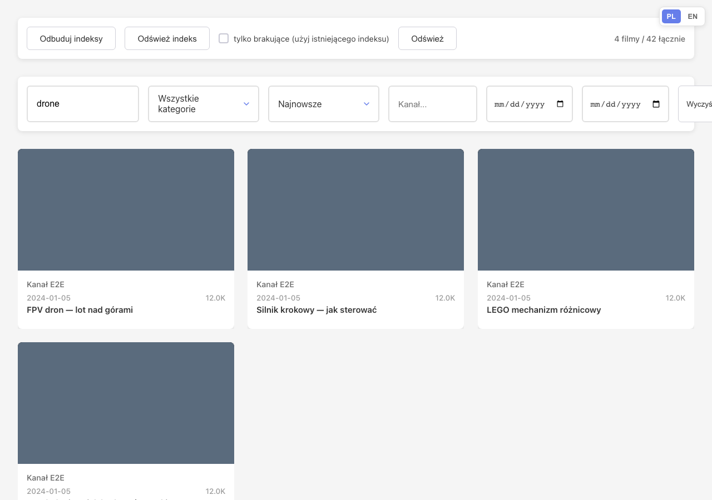
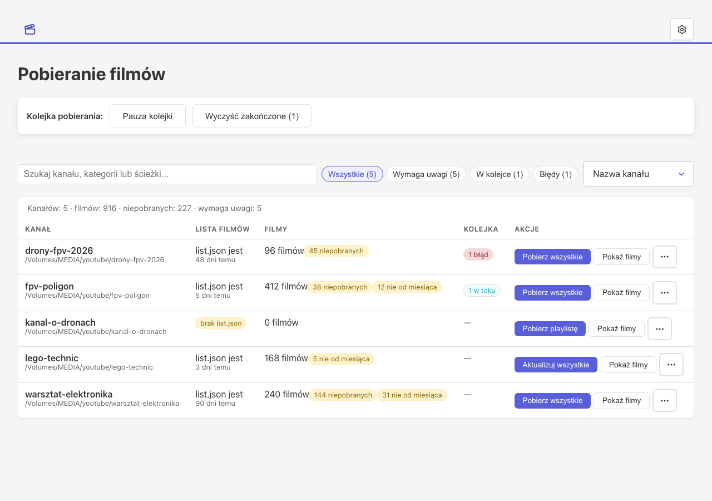
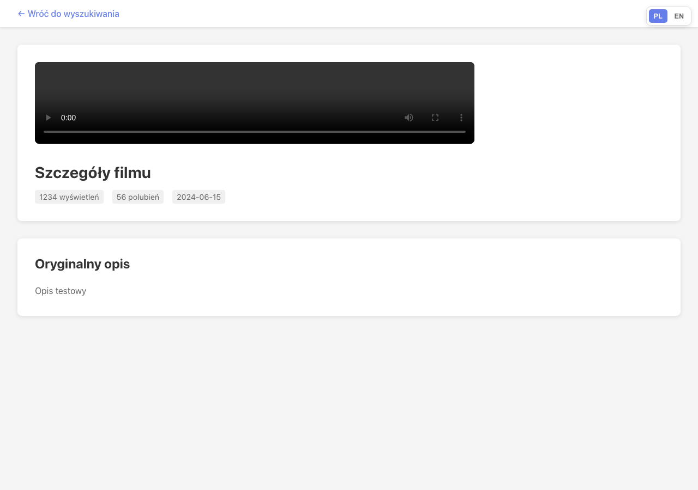

# Video Search App

[](https://github.com/przbat-public/videodeck/actions/workflows/ci.yml)
[](https://github.com/przbat-public/videodeck/actions/workflows/codeql.yml)
[](LICENSE)
[](https://github.com/przbat-public/videodeck/releases)

A self-hosted web app for searching and watching YouTube videos downloaded
with yt-dlp. Titles, descriptions, comments and subtitle transcripts land in
an Elasticsearch index; the browser player handles multi-language subtitles;
a server-side queue drives yt-dlp per channel. A Chrome extension enqueues
videos straight from YouTube.

- Search works when you skip Polish diacritics: `srodek` finds `środek`
- In-browser player with the downloaded subtitles
- Per-channel download settings and a queue that survives closed tabs
- Polish/English UI with a dark theme

## Screenshots

<p align="center">
  
  
  
</p>

> Polish documentation: [Polish version](docs/README.pl.md)

## Features

- **Video search** - full-text search over title, description, transcript and
  comments with diacritic folding; sort by relevance, date, views or likes,
  paginated results
- **Video player** - HTML5 playback with subtitles from the downloaded `.vtt`
  files
- **Details** - title, description, stats, channel and the comment tree with
  nested replies
- **Filters** - category (per channel, from `config.json`) and channel; the
  whole search state lives in the URL, so links are shareable
- **Cache refresh** - reindex from disk without downtime (alias switching),
  with an "only missing" mode for freshly attached drives
- **Download queue** - download and update jobs, per-folder concurrency,
  pause, cancel, live progress
- **Chrome extension** - enqueue from YouTube with SSE progress and a badge
  counter
- **Responsive + dark mode** - works from phone to desktop, light/dark/system
  theme
- **Polish and English UI**

## Quickstart

1. Install dependencies for the whole workspace:

   ```bash
   pnpm install   # frozen, CI-style: pnpm run install:ci
   ```

2. Start Elasticsearch (bound to loopback; no password):

   ```bash
   docker run -d -p 127.0.0.1:9200:9200 -p 127.0.0.1:9300:9300 -e "discovery.type=single-node" -e "xpack.security.enabled=false" -e "xpack.security.enrollment.enabled=false" docker.elastic.co/elasticsearch/elasticsearch:9.5.1
   ```

   Homebrew or a manual install work too: see the
   [installation reference](docs/INSTALL.md).

3. Create `server/.env`:

   ```
   VIDEOS_FOLDER_PATH=/path/to/videos/folder
   ELASTICSEARCH_URL=http://localhost:9200
   ```

   Several folders? Separate them with `;` or `,`. Removable-drive patterns
   and every optional variable are covered in the same reference.

4. Run the app:

   ```bash
   pnpm run dev
   ```

   Server on `http://localhost:3001`, UI on `http://localhost:3000`.

5. Index the videos once. On the film list, open the gear menu in the top
   bar and pick **"Refresh index"** (pl: „Odśwież indeks"), or call
   `GET /api/videos/refreshCache`. Large libraries take a while; progress
   shows in a toast.

## Requirements

- Node.js 22.x (corepack provides pnpm 12.4.2, pinned in `packageManager`)
- Elasticsearch 8.x or 9.x (local or remote)
- Chrome 88+ (only for the Chrome extension)

## Configuration

The essentials:

| Variable              | What it does                                                                    |
| --------------------- | ------------------------------------------------------------------------------- |
| `VIDEOS_FOLDER_PATH`  | one or more folders to scan (separate with `;` or `,`)                          |
| `ELASTICSEARCH_URL`   | Elasticsearch address                                                            |
| `API_TOKEN`           | bearer token protecting `/api`; set it before exposing the server beyond loopback |
| `OPENAI_API_KEY`      | enables AI summaries (`GET /api/videos/:id/summary`)                            |

The full reference (concurrency, rate limits, CORS, host allowlist,
extension origins and more) is in the installation reference linked above.
Security implications are in the Security section below.

## Documentation

| Document                                        | Covers                                                                 |
| ----------------------------------------------- | ---------------------------------------------------------------------- |
| [INSTALL.md](docs/INSTALL.md)                   | setup options, every environment variable, production builds           |
| [DEPLOYMENT.md](docs/DEPLOYMENT.md)             | Docker deployment, upgrades, backups                                   |
| [API.md](docs/API.md)                           | HTTP endpoints, the indexing model, on-disk formats, `config.json`     |
| [DEVELOPMENT.md](docs/DEVELOPMENT.md)           | linting, tests, coverage, typing, project layout                        |
| [architecture](docs/architecture/)              | typed runtime architecture diagrams                                    |
| [DESIGN.md](DESIGN.md)                          | the UI design contract; a static landing page built from the same tokens lives at [docs/landing/index.html](docs/landing/index.html) |
| [README.pl.md](docs/README.pl.md)               | this file in Polish                                                    |
| [CONTRIBUTING.md](CONTRIBUTING.md)              | workflow, quality gates, conventions                                   |
| [SECURITY.md](SECURITY.md)                      | vulnerability reporting and scope                                      |
| [CHANGELOG.md](CHANGELOG.md), [RELEASING.md](RELEASING.md) | what changed, how releases are cut                        |
| [extension README](chrome-extension/README.md)  | the extension                                                          |

## Development

```bash
pnpm run dev          # server :3001 + client :3000
pnpm run test         # unit tests: server (jest), client and extension (vitest)
pnpm run test:e2e     # Playwright against the mocked API (once: cd client && pnpm exec playwright install chromium)
```

Lint rules, the test matrix, the coverage ratchet and the strict TypeScript
flags: [DEVELOPMENT.md](docs/DEVELOPMENT.md). The branch/PR/squash workflow
and the full verification gate are described in CONTRIBUTING.md.

## Architecture

The runtime architecture is authored as typed JSON in
[docs/architecture/](docs/architecture/) and compiled by the vendored
archify CLI (MIT) into a self-contained interactive map
(`videodeck.architecture.html` in the same directory).
`pnpm run test:scripts` validates every diagram and checks that the
committed HTML matches a fresh render, so the map cannot drift from its
source.

## Internationalization (Polish / English)

- **Client** (`client/src/i18n/`): react-i18next with `locales/pl.json`
  and `en.json` catalogs. All UI strings (pages, components, toasts, reindex
  progress, job statuses) go through `t()` with typed keys (a typo in a key
  is a TypeScript error). Polish is the default and fallback language;
  the PL/EN switcher in the top-right corner saves the choice to localStorage.
  Pluralization uses i18next rules (the Polish catalog has 1 film / 2 filmy / 5 filmów forms).
- **Chrome extension** (`chrome-extension/_locales/{pl,en}/messages.json`):
  native `chrome.i18n`: `default_locale: "pl"` in the manifest,
  `chrome.i18n.getMessage` in the code, and the static HTML is translated via
  `[data-i18n]` (`src/lib/i18n.ts`). The extension follows the browser
  language (fallback: Polish).
- **Server**: API messages stay in English (stable for logs and
  tests); the client adds its own translated error prefixes.

A new key is added in `pl.json`, `en.json` (optionally in the extension's
`messages.json`); client keys are type-checked, so an inconsistency surfaces
in typecheck. Client tests run with the default Polish; E2E checks
language switching in both directions.

## Security

The server listens on `127.0.0.1` only by default, and CORS allows only
local origins (`localhost`/`127.0.0.1`) and Chrome extensions. Without
`API_TOKEN`, the API is open to local processes, but browser requests
from foreign pages are rejected (`Sec-Fetch-Site: cross-site` → 403), so a
malicious website cannot trigger a reindex or enqueue jobs.

Additional protections:

- **Host allowlist (DNS rebinding)**: the server only accepts a `Host`
  header from loopback (`localhost`, `127.0.0.1`, `[::1]`) or from
  `ALLOWED_HOSTS`. An attacker's domain that resolves to 127.0.0.1 sends
  its own `Host` and gets a 403 before it reaches the API.
- **SSRF via video URL**: `POST /api/folder/queue` and `/api/folder/download-video`
  accept only YouTube URLs (recognized by `shared/youtube.ts`);
  any other URL (including `file://` or IP addresses) is rejected, and yt-dlp
  always receives the canonical `https://www.youtube.com/watch?v=<id>`.
- **Forbidden yt-dlp flags**: `extraArgs` in `config.json` will not pass
  through `--exec`, `--config-locations`, `--cookies`/`--load-cookies`/
  `--cookies-from-browser`, `--proxy`, `--netrc`, `--username`, `--password`,
  or `--video-password` (RCE, cookie theft, credential leaks).
  `PUT /api/folder/config` rejects these flags, and in a hand-edited file
  they are ignored (together with their value). The match also covers the
  short spellings (`-a`, `-u`, `-p`) and the abbreviated long forms yt-dlp
  accepts (`--prox`, `--print-to-fi`), and the argument builder refuses them
  before yt-dlp starts.
- **No open API on a network interface**: the server refuses to start when
  `HOST` is not a loopback address and neither `API_TOKEN` nor
  `REQUIRE_API_TOKEN=true` is set. Publishing the API to the network takes a
  token, not a forgotten variable.
- **Exact extension id in CORS**: by default (dev mode), CORS allows
  any `chrome-extension://…` because developer extensions get a new id
  each time they are loaded. Set `EXTENSION_ORIGINS` with the exact id
  (visible on `chrome://extensions`) so that the API is only called by
  your extension.

For remote access, set `API_TOKEN` (and optionally `HOST=0.0.0.0` +
`ALLOWED_HOSTS` + `CORS_ORIGINS`): every request to `/api` must then carry
`Authorization: Bearer <token>`. The Chrome extension has a "Token API" (pl: „Token API")
("API token") field in its options; `/health` stays public for connection
tests.

Vulnerability reporting and scope: [SECURITY.md](SECURITY.md).

## License

MIT. See [LICENSE](LICENSE).

## Contributing

Bugs, ideas and pull requests are welcome. Start with
[CONTRIBUTING.md](CONTRIBUTING.md) and the
[CODE_OF_CONDUCT.md](CODE_OF_CONDUCT.md); the architecture map lives in
[docs/architecture/](docs/architecture/).
